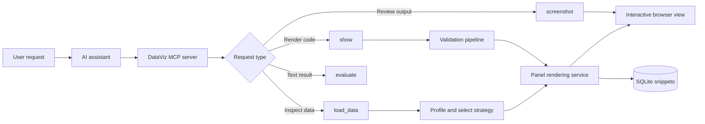
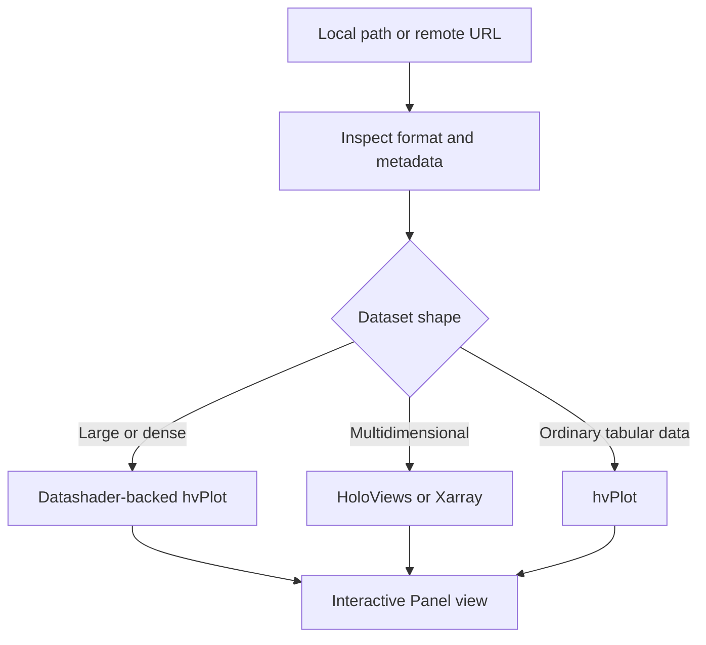
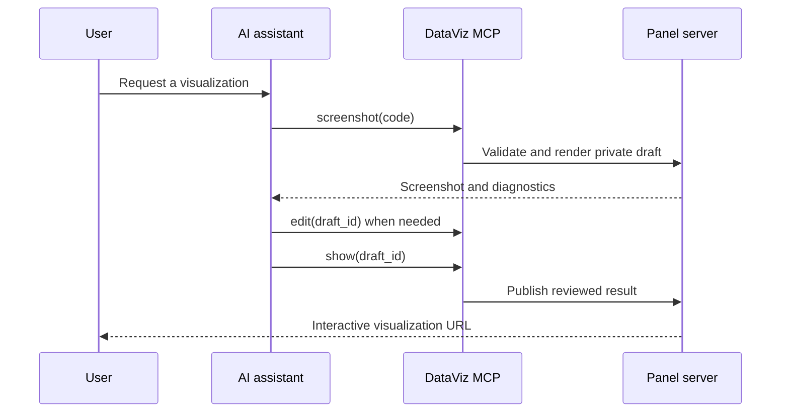

<div align="center">
  

  <h1>DataViz MCP</h1>

  <p><strong>Turn natural-language requests and Python code into live, inspectable visualizations.</strong></p>

  <p>
    A local visualization server for AI assistants, developers, and data teams.<br>
    Built with MCP, Panel, HoloViz, Datashader, and the wider PyData ecosystem.
  </p>

  <p>
    <a href="https://github.com/SuMayaBee/DataViz-MCP/actions/workflows/ci.yml"></a>
    <a href="https://pypi.org/project/dataviz-mcp"></a>
    <a href="https://prefix.dev/channels/conda-forge/packages/dataviz-mcp"></a>
    <a href="https://pypi.org/project/dataviz-mcp"></a>
  </p>

  <p>
    <a href="https://SuMayaBee.github.io/DataViz-MCP/">Documentation</a> ·
    <a href="https://SuMayaBee.github.io/DataViz-MCP/tutorials/installation/">Installation</a> ·
    <a href="https://SuMayaBee.github.io/DataViz-MCP/tutorials/mcp-server/">MCP tutorial</a> ·
    <a href="https://SuMayaBee.github.io/DataViz-MCP/examples/">Examples</a>
  </p>
</div>

## What is DataViz MCP?

DataViz MCP connects an AI assistant to a local Panel server. The assistant can inspect data,
generate Python visualization code, validate it, render it as an interactive web page, review the
result in a browser, and refine it before sharing the final visualization.

It supports two complementary workflows:

- **MCP mode:** create and inspect visualizations from VS Code, Cursor, Claude, and other MCP clients.
- **Standalone mode:** submit, browse, edit, and publish visualizations from a local web interface.

### AI-assisted visualization


### Standalone visualization workspace


## Why DataViz MCP?

| Capability | What it provides |
|---|---|
| Natural-language workflow | Ask an assistant to inspect data, create a chart, or build an interactive dashboard. |
| Adaptive data loading | Detect simple, multidimensional, remote, and large datasets before selecting a renderer. |
| Large-data visualization | Use Datashader-backed rasterization for dense datasets. |
| Multidimensional data | Inspect NetCDF and tabular dimensions with Xarray and HoloViews support. |
| Broad library support | Render hvPlot, HoloViews, Panel, Bokeh, Plotly, Altair, Matplotlib, Seaborn, and more. |
| Visual review | Capture browser screenshots so the assistant can inspect clipping, layout, and readability. |
| Safe iteration | Validate syntax, imports, extensions, and common security issues before rendering. |
| Persistent results | Store snippets in SQLite with stable local URLs and full-text search. |
| Resilient service | Monitor the Panel process, check health, and restart it when required. |

## How it works



The MCP process coordinates tools and validation. A separate Panel process renders the visual
output, while SQLite stores snippets and their publication state.

### Automatic data strategy



Source location and data shape are treated separately. A remote dataset can still be simple,
multidimensional, or large.

## Quick start

### 1. Install

Python 3.12 or later is required. The `pydata` extra installs the broad visualization stack.

```bash
uv tool install "dataviz-mcp[pydata]"
pls install-browser
pls --version
```

You can also use pip inside a virtual environment:

```bash
python -m venv .venv
source .venv/bin/activate
pip install "dataviz-mcp[pydata]"
pls install-browser
```

Windows PowerShell activation:

```powershell
python -m venv .venv
.venv\Scripts\Activate.ps1
pip install "dataviz-mcp[pydata]"
pls install-browser
```

See the complete [installation guide](https://SuMayaBee.github.io/DataViz-MCP/tutorials/installation/)
for pixi, uv, pip, Windows, and environment-specific instructions.

### 2. Connect an MCP client

DataViz MCP can add its configuration without replacing your other MCP servers:

```bash
pls install vscode
```

Other supported targets include:

```bash
pls install cursor
pls install claude-desktop
pls install windsurf
pls install cline
pls install gemini
pls install kiro
pls install copilot
```

For manual VS Code configuration, find the executable first:

```bash
which pls
```

Then create `.vscode/mcp.json`:

```json
{
  "servers": {
    "dataviz-mcp": {
      "type": "stdio",
      "command": "/absolute/path/to/pls",
      "args": ["mcp"]
    }
  }
}
```

Always use the absolute executable path. Restart the MCP connection after changing the package or
local server code.

### 3. Ask for a visualization

Try a direct request in your MCP client:

> Create an interactive scatter plot that compares departure delay with arrival delay. Use
> Datashader if the dataset is large and explain the visible pattern.

Or inspect data without creating a chart:

> Analyze this dataset, summarize its structure and quality, and recommend useful visualizations
> without creating a plot yet.

## MCP tools

| Tool | Purpose |
|---|---|
| `load_data` | Inspect CSV, JSON, JSONL, NDJSON, Parquet, and NetCDF sources, then optionally create a suitable plot. |
| `show` | Validate and publish visualization code as an interactive Panel page. |
| `screenshot` | Render a private draft and capture the browser output for visual review. |
| `edit` | Apply a focused revision to stored visualization code. |
| `evaluate` | Execute a text-only Python check without opening a visualization. |

The packaged [`dataviz-plot-selection`](skills/dataviz-plot-selection/SKILL.md) skill guides chart
choice, renderer selection, visual integrity, and screenshot review. Its guidance is included in the
MCP server instructions automatically.

## Data support

`load_data` accepts local paths and HTTP(S) URLs for:

- CSV
- JSON
- JSONL and NDJSON
- Parquet
- NetCDF (`.nc`)

The tool counts or estimates rows before retaining data, profiles large inputs from a bounded sample,
and reports the full detected shape separately from the sample size. Use `visualize=False` to return
schema, missing values, duplicate counts, descriptive statistics, preview records, and chart
recommendations without creating a visualization.

## Run from the terminal

Start the standalone server:

```bash
pls serve
```

Start the stdio MCP server:

```bash
pls mcp
```

Check the local Panel service:

```bash
pls status
```

The longer `dataviz-mcp` command is also available, but `pls` is easier to type.

## Visual review workflow



This workflow separates visual checking from publication. A draft can be revised without exposing an
unfinished result in the public feed.

## Security

DataViz MCP executes Python supplied by a user or AI assistant with the privileges of the account that
started the process. Validation is a guardrail, not a sandbox.

- Run it only in an environment where you are comfortable executing the submitted code.
- Do not expose the local service port to an untrusted network.
- Review generated code when it accesses files, credentials, or external services.
- Use an isolated virtual environment for demonstrations and development.

## Documentation

- [Installation](https://SuMayaBee.github.io/DataViz-MCP/tutorials/installation/)
- [MCP server tutorial](https://SuMayaBee.github.io/DataViz-MCP/tutorials/mcp-server/)
- [Standalone server tutorial](https://SuMayaBee.github.io/DataViz-MCP/tutorials/standalone-server/)
- [Examples](https://SuMayaBee.github.io/DataViz-MCP/examples/)
- [Architecture](https://SuMayaBee.github.io/DataViz-MCP/explanation/architecture/)
- [Server configuration](https://SuMayaBee.github.io/DataViz-MCP/how-to/configure-server/)

## Development

Clone the project and install the development environment:

```bash
git clone https://github.com/SuMayaBee/DataViz-MCP.git
cd DataViz-MCP
pixi install
pixi run postinstall
pixi run test
```

See the [contributing guide](https://SuMayaBee.github.io/DataViz-MCP/tutorials/contributing/) for
environment setup, testing, linting, documentation, and pull request guidance.

## Contributing

Contributions, bug reports, documentation improvements, and visualization examples are welcome.

1. Fork the repository.
2. Create a focused branch.
3. Add the change and its tests or documentation.
4. Run the test and lint tasks.
5. Open a pull request with a clear explanation and screenshots when the UI changes.

## License

See the repository license for usage and redistribution terms.
